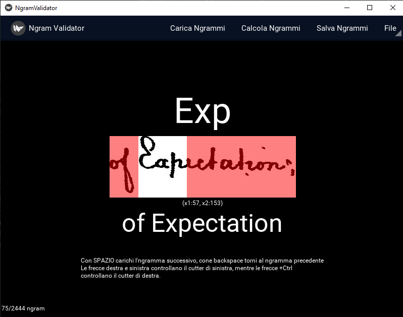
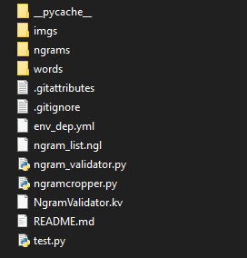

# Validation N-Grams Tool
il Ghit contiene il software per estrarre Ngrammi daun insieme di parole etichettate e di validarli.



## Operazioni Preliminari
La prima operazione da effettuare e l'installazione di tutti i moduli richiesti per l'esecuzione degli script. 
Puoi utilizzare Anaconda per creare un Virtual Enviroment pronto con tutte le dipendenze e tutti i moduli:


```console
conda env create -f environment.yml
conda activate kivy
```

Se non sono presenti, crea le cartelle 'words' e 'ngrams' nella cartella di lavoro:


A questo punto carica all'interno della cartella 'words' tutte le immagini di parole etichettate dalla quale desideri estrarre gli N-grammi.
> :warning: **Attenzione al nome dei file delle immagini**: Il nome dei file delle immagini devono rispettare questo schema: ```Z_X_Y_transcript.py``` dove Z = ID_pagina, X = ID_riga, Y = posizione_parola_all'interno_della_riga.


## Avviare l'interfaccia
Per avviare l'interfaccia basta lanciare il comando

```console
python .\ngram_validator.py
```

Cliccando su ```Calcola Ngrammi``` è possibile calcolare gli Ngrammi specificando il numero di caratteri da considerare. In questo modo è anche possibile ripulire la lista di N-Grammi calcolati.

Se esistono N-grammi calcolati dal sistema, cliccando su ```Carica Ngrammi``` l'interfaccia inizia a mostrare tutti gli N-Grammi calcolati. Da questo momento si possono visualizzare tutti gli N-grammi: premendo SPAZIO si puà visaulizzare il prossimo N-Gramma, mentre premendo BACKSPACE si può visualizzare l'N-gramma precedente.

Una volta visualizzato un ngramma è possibile cambiare i confini di taglio. Con i tasti ```Freccia destra``` e ```Freccia sinistra``` si puà modificare il confine di taglio di sinistra, mentre con la combinazione ```Ctrl```+```Freccia destra``` e ```Ctrl```+```Freccia sinistra``` si puà modificare il confine di taglio di destra.

> :warning: **Attenzione ai BUG**: c'è ancora qualche bug, a volte i comandi non rispondono. Se capita basta riavviare il programma. I salvataggi sono automatici, niente andrà perso!!

Cliccando su ```Salva Ngrammi``` è possibile generare le immagini degli N-grammi. Le immagini verranno memorizzate nella cartella 'ngrams'
> :warning: **Attenzione**: Una volta richiamata la funzione 'Salva Ngrammi', il contenuto della cartella 'ngrams' verrà totalmente sovrascritto! Salva prima i file se ti servono!


